# 一个高考志愿推荐网站，Python+Django+Spark。Python数据爬虫，Python数据清洗，Mysql数据存储，Spark数据处理，Django网页框架。

## 项目说明：

- 这是一个课设形式的作业，代码都是边学边敲的，因此代码结构性不强
- 本项目的整体结构还算完整，本着开源精神发布在Github，需要的朋友自取
- 本代码禁止用于商业用途，包括但不限于盗取代码去B站等平台出售，严重警告!!!
- 如果发现违规者，请帮忙点一手举报
- QQ：3533696826
- 最后，一句话送给亲爱的盗码人：你真tm是g娘养的，要不然怎么是一副g样

## 源码说明：

- python爬虫源码
- python清洗数据源码
- 爬虫数据+清洗数据
- 数据插入mysql数据库的源码
- python+django源码

## 截图：

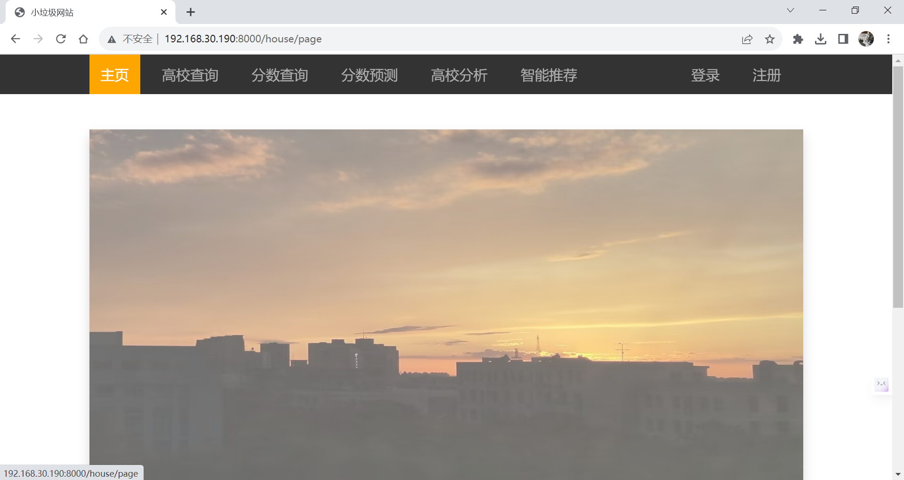

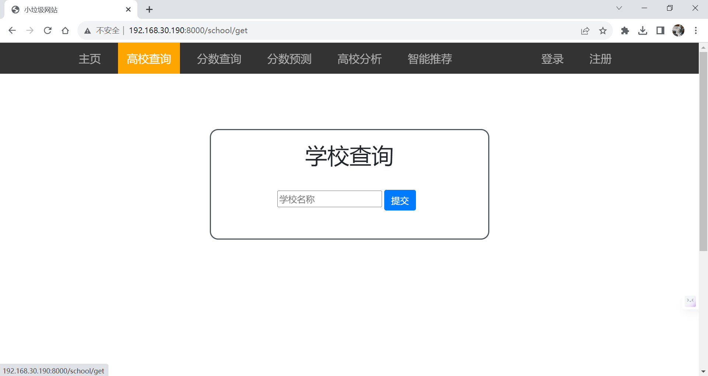

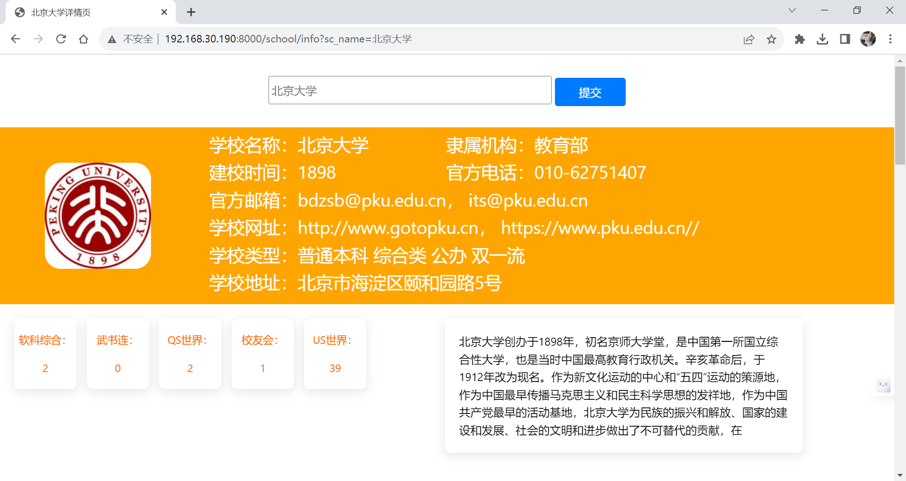

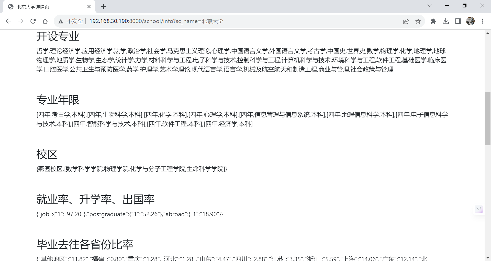

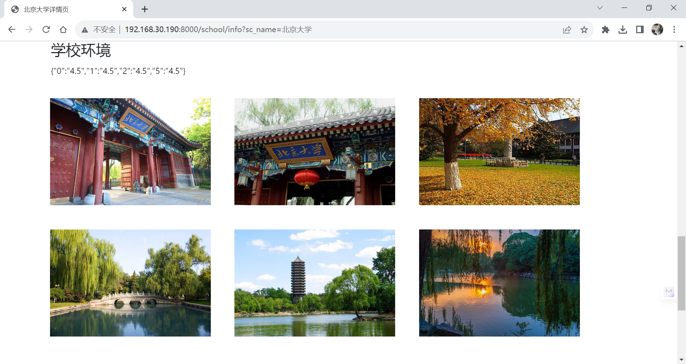

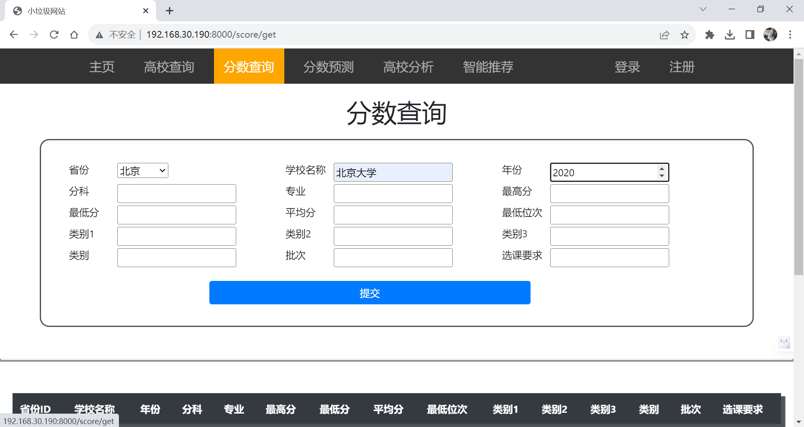

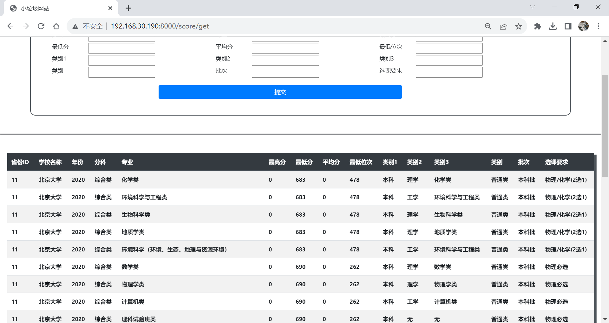

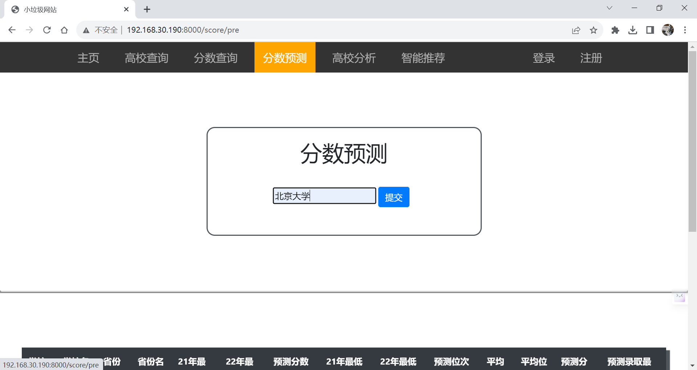

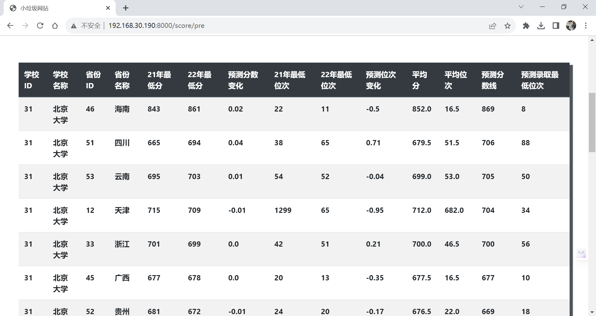

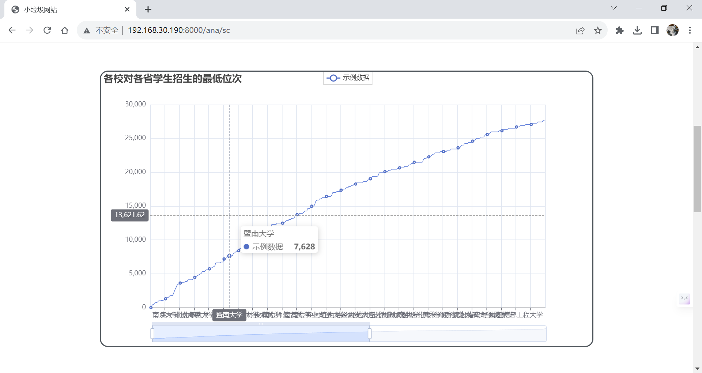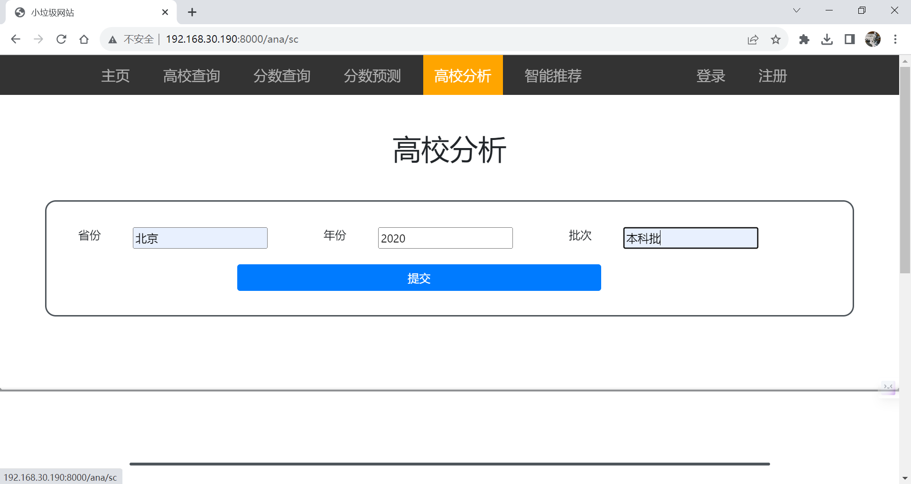

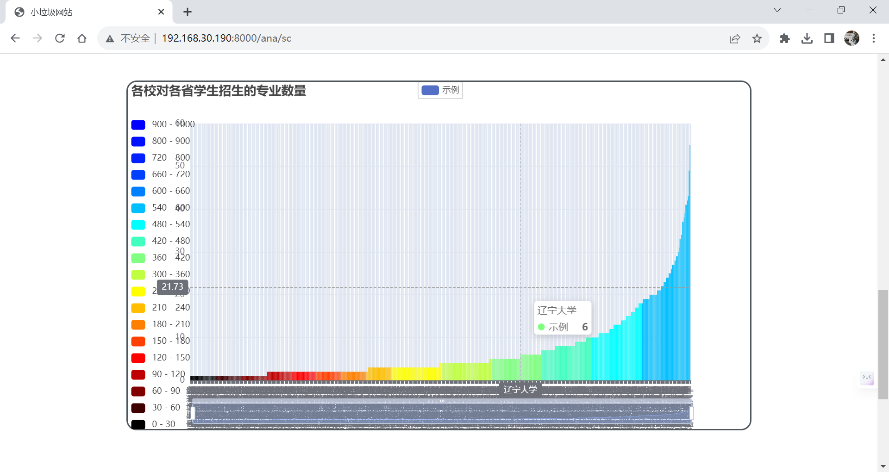

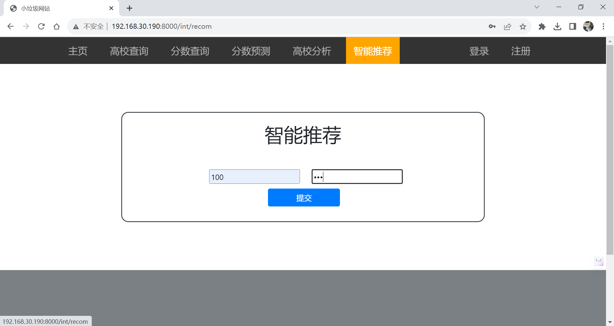

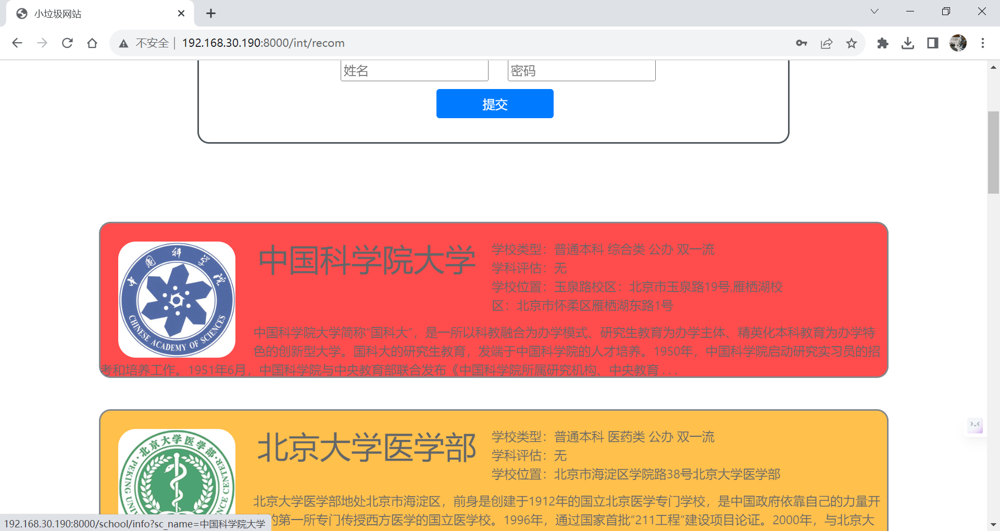

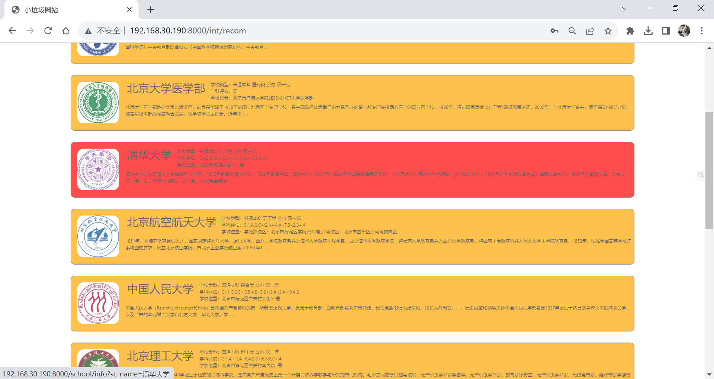

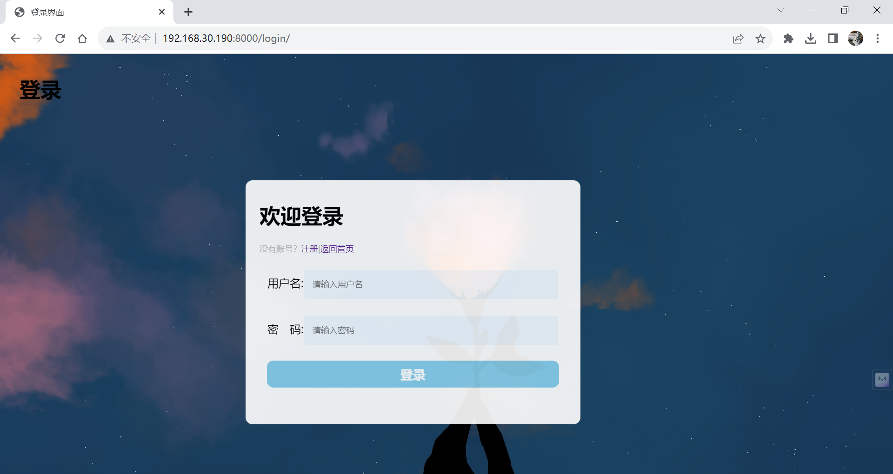

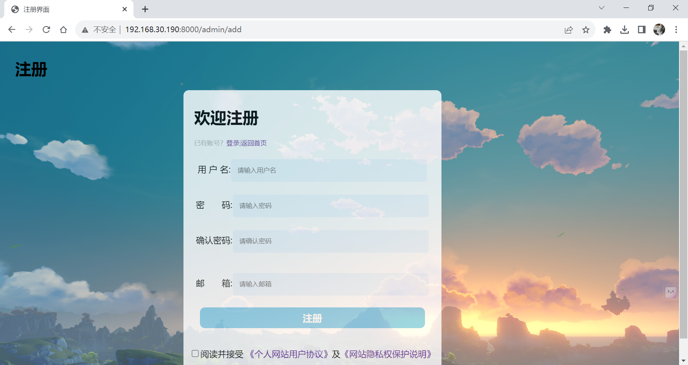

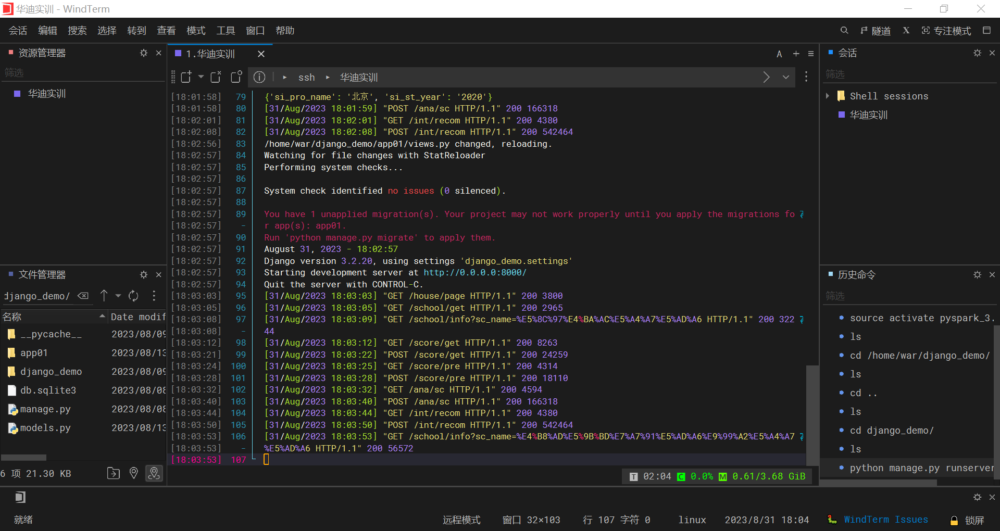

## 后记：

- 如果代码对你有帮助，请杯奶茶吧(*^▽^*)

