# 一个高考志愿推荐网站，Python+Django+Spark。Python数据爬虫，Python数据清洗，Mysql数据存储，Spark数据处理，Django网页框架。

## 源码有偿，加QQ：3533696826

## 源码说明：

- python爬虫源码
- python清洗数据源码
- 爬虫数据+清洗数据
- 数据插入mysql数据库的源码
- python+django源码

## 截图：

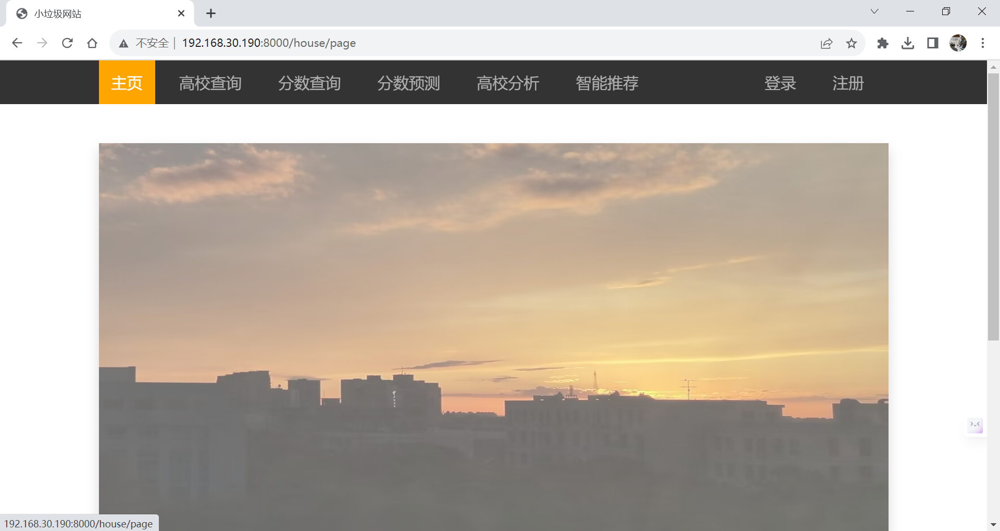

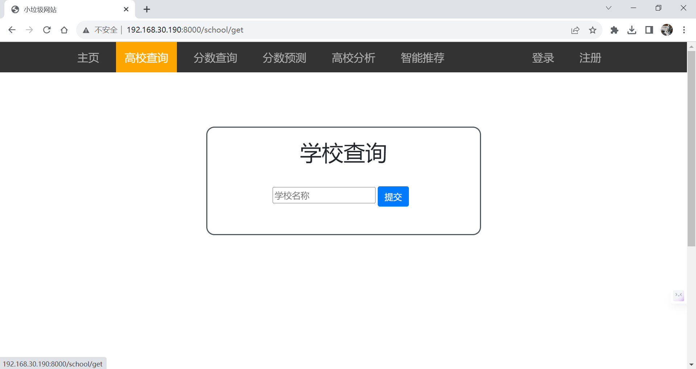

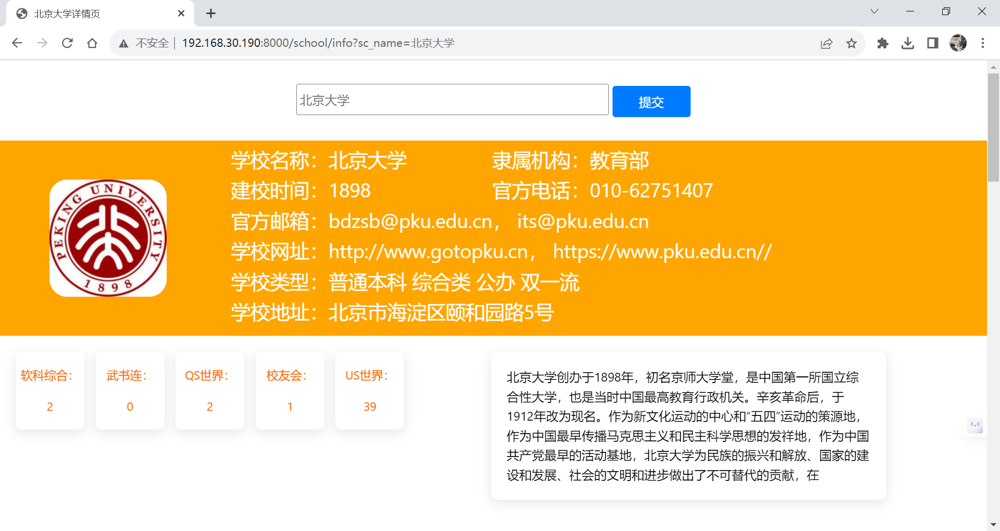

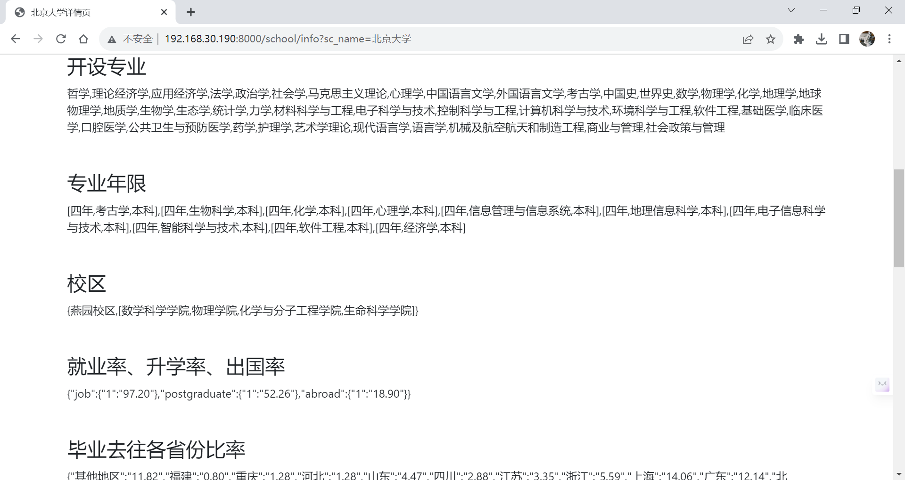

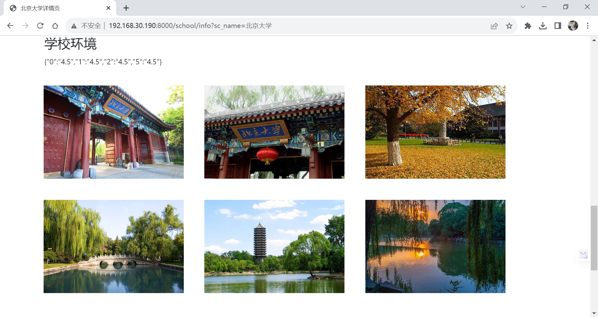

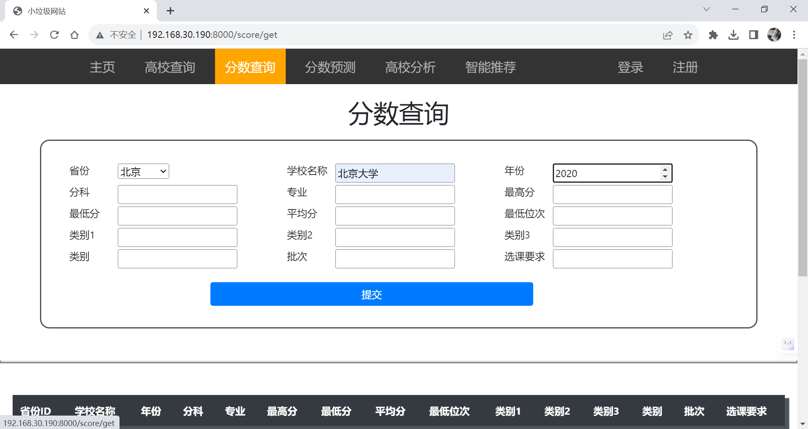

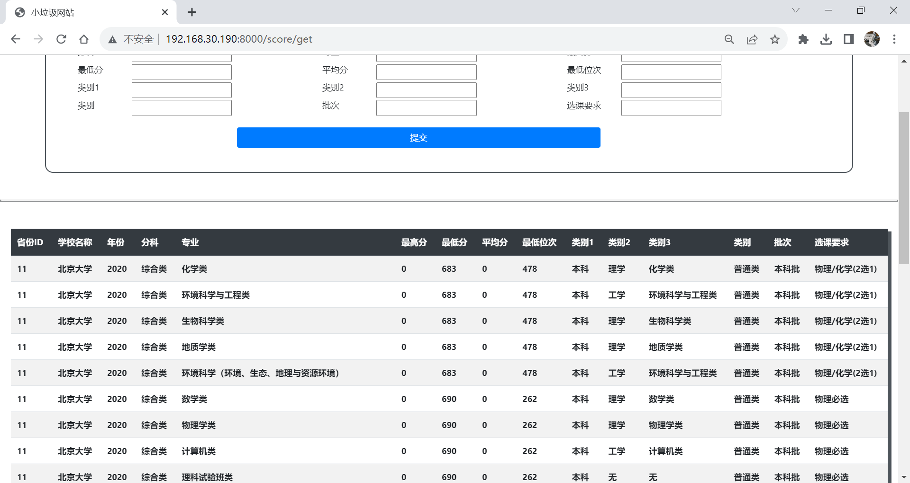

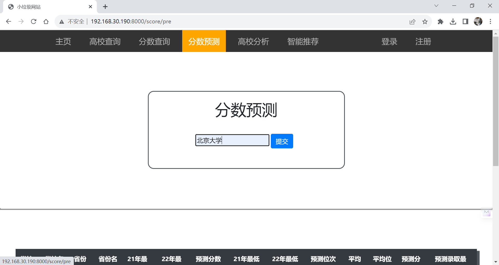

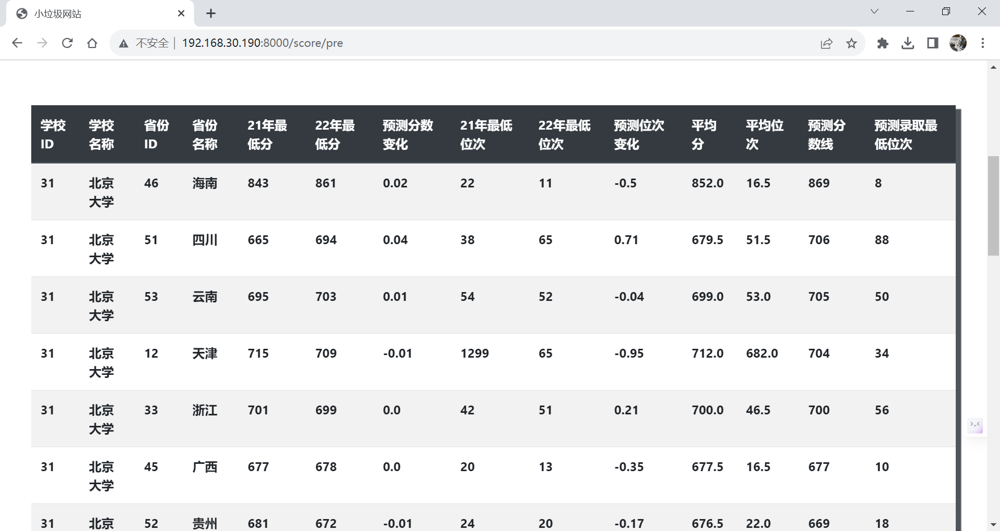

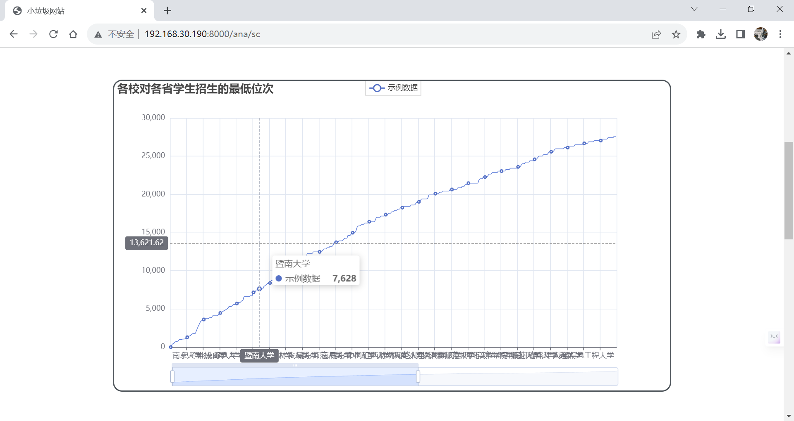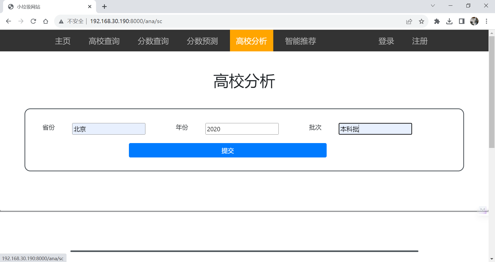

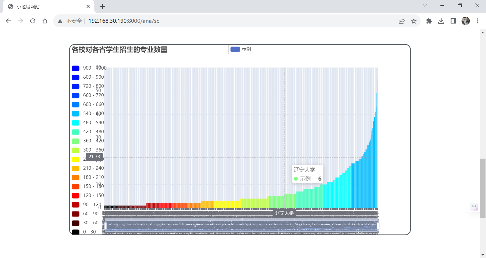

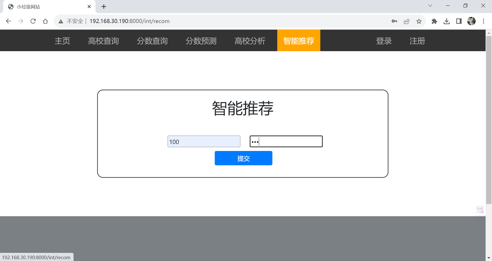

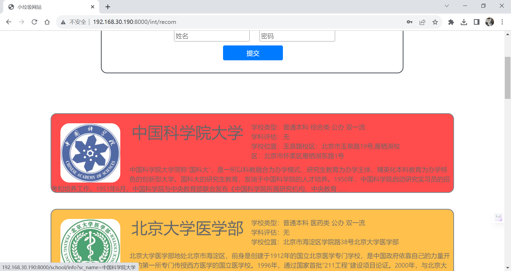

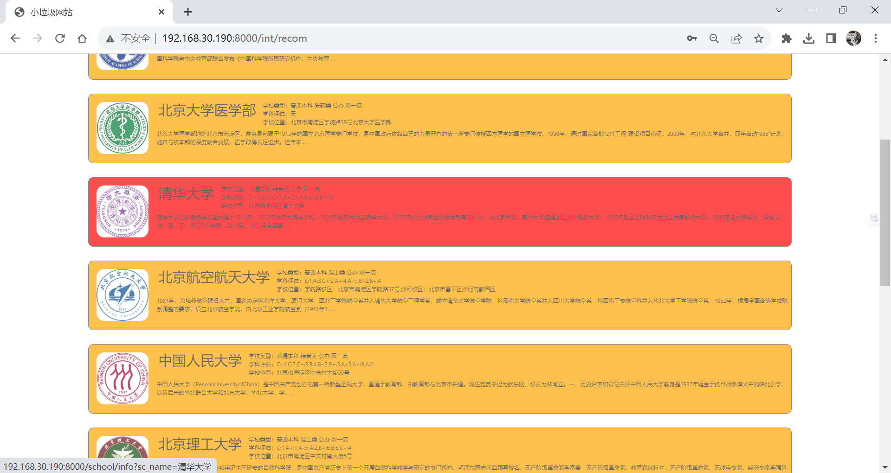

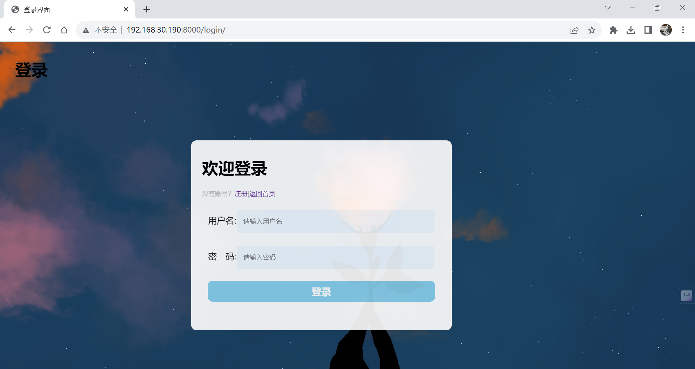

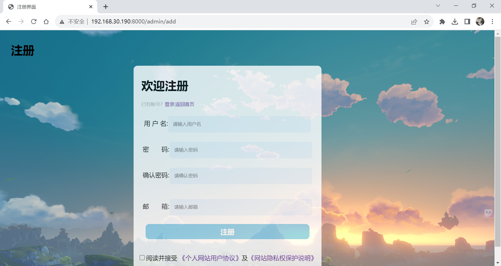

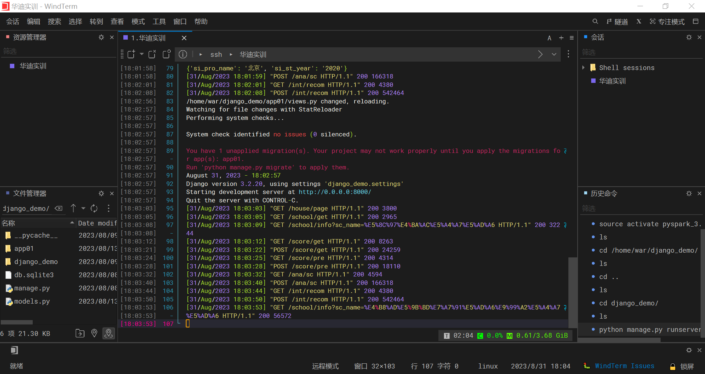
